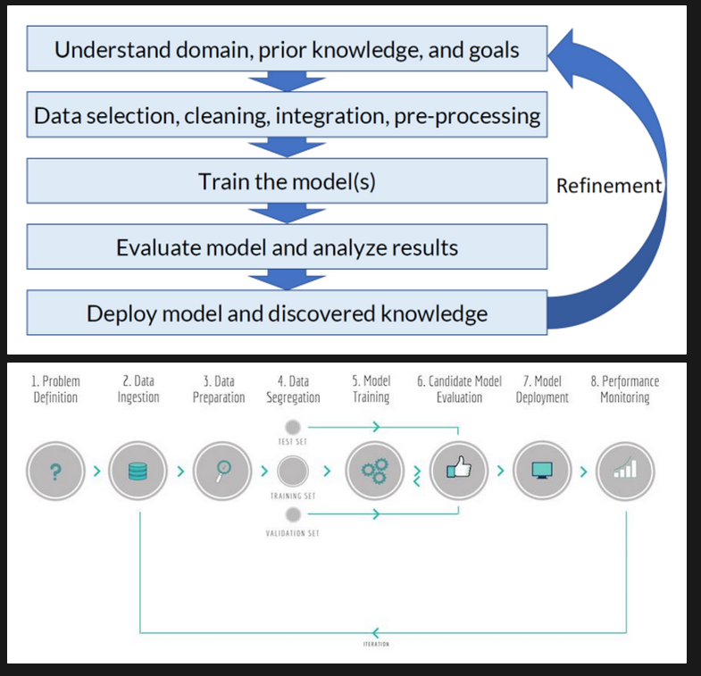

# **2. Machine Learning vs. Data Science**

### Terminology
- **Training Set** Dataset Describing a particular problem
- **Test Set** Dataset against which the model will be tested
- **Input Variables** Set of variables that characterize each instance of the problem
- **Output Variables** Set of variables that answer the problem

# Methodologies for Knowledge Extraction

A methodology for knowledge extraction, often associated with Data Mining, outlines and establishes a set of steps that the development of a data mining project should follow to address problems effectively.

- **Adapting Data Mining to a Methodology:**
  1. Ensures Robustness.
  2. Facilitates Understanding, Implementation, and Development.
  3. Enables Process Replication.
  4. Assists in Project Planning and Management.
  5. Provides Maturity to the Knowledge Extraction/Data Mining Process.
  6. Encourages the Adoption of Best Practices.

- **Importance of Standardized Methodologies:**
  1. Enables Project Replication.
  2. Assists in Project Planning and Management.
  3. Encourages the Adoption of Best Practices, Leading to Improved Results.

Standardized methodologies offer several advantages in the context of knowledge extraction and data mining. They not only ensure consistency and robustness but also contribute to better project understanding, implementation, and development. Replicating processes becomes more straightforward, aiding in project planning and management. Additionally, standardized methodologies contribute to the maturity of the knowledge extraction/data mining process and foster the adoption of best practices for achieving superior outcomes.

# CRISP-DM (Cross Industry Standard Process for Data Mining)

## Objectives:
- Define a Knowledge Extraction (KE) process for the industry.
- Build and provide support tools.
- Ensure the quality of Knowledge Extraction (KE) projects.
- Reduce specific KE knowledge needed to conduct a KE process.

## Process Model:
CRISP-DM presents a structured process model aimed at defining a "script" for the development of Knowledge Extraction (KE) projects. This process unfolds in six stages:

1. **Business Understanding:**
   - Define project objectives and articulate the KE problem.

2. **Data Understanding:**
   - Obtain data and identify data quality issues.

3. **Data Preparation:**
   - Select attributes and perform data cleaning.

4. **Modeling:**
   - Experiment with Knowledge Extraction tools.

5. **Evaluation:**
   - Compare results with business objectives.

6. **Deployment:**
   - Put the model into production.

## Significance of CRISP-DM:
CRISP-DM is instrumental in achieving several objectives within the field of Knowledge Extraction and Data Mining. It provides a systematic approach to understanding business goals, handling data, preparing it for analysis, building models, evaluating outcomes, and deploying successful models into production. The structured nature of CRISP-DM enhances the efficiency of Knowledge Extraction projects, making them more manageable, replicable, and aligned with industry best practices.

# SEMMA (Sample, Explore, Modify, Model, and Assess)

## Motivation:
The SEMMA methodology (Sample, Explore, Modify, Model, and Assess) was developed to address the need for defining, standardizing, and integrating Data Mining systems or processes into production cycles.

## Five Steps of the Data Mining Process in SEMMA:

1. **Sample:**
   - Extract data from the problem universe.
   - Base the Data Mining process on the concept of a "sample" of the problem.
   - Utilize a small yet significant sample.
   - Provides flexibility and speed in data processing.

2. **Explore:**
   - Conduct visual and/or numerical exploration of trends.
   - Refine the discovery process through mining.
   - Apply statistical techniques such as linear regression, least squares, Poisson distribution, etc.
   - Search for unforeseen trends in the data.

3. **Modify:**
   - Concentrate on all necessary modifications.
   - Include additional information.
   - Select or introduce new variables.
   - Objective: Create, select, and adapt variables for the next step.

4. **Model:**
   - Define data mining model construction techniques (e.g., artificial neural networks, decision trees, linear regression).
   - Choose techniques based on the type of data present in each model (e.g., artificial neural networks are more suitable for problems with complex data relationships).

5. **Assess:**
   - Measure the performance of the Data Mining model.
   - Apply the model to a sample of test data.
   - Implement model adjustment procedures.

## Significance of SEMMA:
SEMMA provides a structured approach to the Data Mining process, ensuring that data is effectively sampled, explored for trends, modified for optimal analysis, modeled using appropriate techniques, and rigorously assessed for performance. This methodology is geared towards integrating Data Mining seamlessly into production cycles, enhancing efficiency, and ensuring the reliability of the results obtained from the mining process.

# PMML (Predictive Model Markup Language)

## Objectives:
- **Expand to Standardize the WWW:**
  - The goal is to extend PMML to become a standard for the World Wide Web (WWW), ensuring compatibility and interoperability across various platforms and applications.

## Overview of PMML:
- PMML is a language designed for describing Data Mining models, and it utilizes XML (eXtensible Markup Language) to represent these models.

## Key Features of PMML:
- **Interoperability:**
  - PMML allows applications to use multiple data sources seamlessly, eliminating concerns about differences between them. This feature promotes flexibility and ease of integration in diverse environments.

- **Combined and/or Cooperative Use:**
  - PMML facilitates the combined and/or cooperative use of Data Mining models. This means that multiple models can be integrated to leverage their strengths collectively, enhancing the overall analytical capabilities of applications.

- **Administration Based on Business Areas:**
  - PMML enables the administration of Data Mining models based on business areas. This ensures that models can be organized, managed, and maintained in a way that aligns with specific business needs, making it easier to implement and oversee the application of these models within different domains.

## Significance of PMML:
PMML plays a crucial role in promoting interoperability, collaboration, and effective management of Data Mining models. By utilizing XML, PMML provides a standardized way to represent models, making it easier for applications to seamlessly integrate diverse data sources and utilize multiple models in a combined or cooperative manner. Additionally, the ability to administer models based on business areas enhances the practical implementation and management of Data Mining processes across various business domains.

# Pipeline

Learning is equivalent to searching (optimization) through the space of potential hypotheses (representation) to find one that best fits (evaluation) the training.

