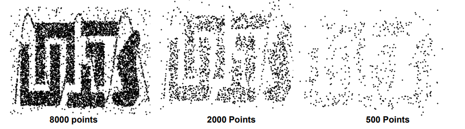

# **Qualidades e Exploracao de Dados**

# Why Data Preparation?

Data preparation is a crucial step in the data mining process, primarily aimed at transforming datasets so that the information they contain becomes accessible to data mining tools.

## Objectives of Data Preparation:

1. **Exposing Information to Data Mining Tools:**
   - The primary goal is to reformat datasets to make the information they contain accessible to data mining tools. This ensures that the tools can effectively analyze and extract valuable insights from the data.

2. **Formatting Data for Data Mining Tools:**
   - Data must be properly formatted to be eligible for use with data mining tools. This involves structuring the data in a way that aligns with the requirements and capabilities of the chosen data mining tool.

3. **Real-world Data Challenges:**
   - Data acquired from the real world often presents challenges, including:
     - **Incompleteness:** Missing values that need to be addressed.
     - **Noise:** Unwanted or irrelevant information that requires filtering.
     - **Inconsistencies:** Discrepancies or errors that need correction.

## Data Preparation Challenges:

- **Time-Consuming Task:**
   - Data preparation is often the most time-consuming task in the data mining process. This is because it involves handling various data challenges and ensuring that the data is in a suitable format for analysis.

- **Least Preferred Task:**
   - Despite its importance, data preparation is frequently the least favorite task among practitioners. This is due to the meticulous nature of the work and the need for attention to detail in addressing data quality issues.

In summary, data preparation is a critical process that addresses the challenges inherent in real-world datasets, making them suitable for analysis by data mining tools. Despite being time-consuming and less favored, its significance in ensuring the quality and relevance of data cannot be overstated.


# Data Quality: Missing Values, Duplicated Records, Noise, and Outliers

## Missing Values:

- **Definition:**
  - Missing values represent information that is not available, either because it wasn't collected or due to the presence of sensitive information.

- **Reasons for Missing Values:**
  1. Information not collected (e.g., individuals choosing not to respond).
  2. Attributes not applicable to all cases (e.g., salaries not applicable to children).

- **Handling Missing Values:**
  - Eliminate data objects or variables.
  - Estimate missing values (e.g., for time series of temperature or census results).
  - Ignore the missing value during analysis.

## Duplicated Records/Data:

- **Definition:**
  - Duplicated records refer to the same (or similar) data collected from different sources. The dataset may include data objects that are duplicates or almost duplicates.

- **Challenges:**
  - Significant issue when merging data from heterogeneous sources.
  - Example: Same person with different email addresses.

- **Data Cleaning:**
  - The process of addressing duplicate data issues.

## Noise:

- **Definition:**
  - Noise refers to modifications to the original records, resulting from technological limitations, sensor errors, or human errors. It can be considered extraneous objects.

- **For Attributes:**
  - Noise refers to the modification of original attribute values.

## Outliers:

- **Definition:**
  - Outliers are data points that differ significantly from other observations in the dataset.

- **Significance:**
  - Outliers can either be something that interferes with the analysis or something of interest (e.g., credit card fraud, intrusion detection).

Understanding and addressing issues related to missing values, duplicated records, noise, and outliers are essential for ensuring the quality and reliability of data used in analyses and data mining processes.

# Data Exploration

## Why Data Exploration?

Data exploration is a critical step in the data analysis process, serving several key purposes:

- **Understanding the Data and its Characteristics:**
  - Gain insights into the structure, nature, and composition of the dataset.

- **Evaluating Data Quality:**
  - Assess the quality of the data, identifying issues such as missing values, outliers, or inconsistencies.

- **Finding Patterns and Relevant Information:**
  - Uncover underlying patterns, trends, and meaningful information within the dataset.

## How to Explore Data?

Several techniques and methods can be employed for effective data exploration:

- **Central Tendency Measures:**
  - Utilize measures such as average, mode, median to understand the central location of the data.

- **Statistical Dispersion:**
  - Assess variance, standard deviation, interquartile range to understand the spread or dispersion of the data.

- **Probability Distribution:**
  - Explore probability distributions such as Gaussian, Uniform, Exponential to understand the distributional characteristics of the data.

- **Correlation/Dependence Analysis:**
  - Examine relationships between pairs of features, as well as dependencies with the dependent feature.

- **Data Visualization:**
  - Utilize various data visualization techniques, including tables, charts, box plots, scatter plots, histograms, to visually represent and interpret data patterns.

## Significance of Data Exploration:

Effective data exploration lays the foundation for subsequent analysis and modeling. It helps analysts and data scientists to make informed decisions about data preprocessing, feature selection, and the choice of appropriate modeling techniques. By understanding the data thoroughly, one can ensure the reliability of insights drawn from the dataset.


# Basic Data Preparation

In the context of basic data preparation, a set of techniques can be employed to facilitate the analysis and modeling of data:

1. **Union/Intersection of Columns:**
   - Combine or extract information from different columns.

2. **Concatenation:**
   - Combine data from different sources or concatenate strings.

3. **Sorters:**
   - Arrange data in a specified order to facilitate analysis.

4. **Filters:**
   - Apply filters to columns, rows, or based on nominal and rule-based criteria.

5. **Basic Aggregations:**
   - Perform basic aggregations such as counts, unique values, mean, sum, etc.

6. **Combining Attributes or Objects:**
   - Merge two or more attributes or objects into a single entity.

## Purpose of Data Reduction Techniques:

- **Data Reduction:**
  - Reduce the number of attributes or objects in the dataset.

- **Change of Scale:**
  - Aggregate data (e.g., grouping cities into regions, days into weeks or months) for more stable and less variable data.

## Sampling Techniques:

- **Sampling Overview:**
  - Sampling is a key technique for data reduction, employed in both preliminary data investigation and final analysis.

- **Reasons for Sampling:**
  - Used when obtaining the entire set of data is too expensive or time-consuming.

- **Principle of Effective Sampling:**
  - A sample is representative if it has approximately the same properties of interest as the original dataset.

- **Simple Random Sampling:**
  - Equal probability of selecting any particular item.
  - Sampling without replacement: Each item is removed from the population.
  - Sampling with replacement: Objects can be picked more than once.

- **Stratified Sampling:**
  - Split the data into partitions and draw random samples from each partition.

Effective data preparation, including basic techniques and sampling, plays a crucial role in optimizing datasets for analysis, reducing complexity, and ensuring the efficiency of subsequent data-driven processes.




# Advanced Data Preparation  
## 1. - Feature Scaling

1. **Normalizing the Range of Independent Features**
    - **Rationale:**
      Many classifiers use distance metrics (e.g., Euclidean distance), and if one feature has a broad range of values, the distance calculation will be influenced primarily by this particular feature. Therefore, it's essential to normalize the range so that each feature contributes proportionately to the final distance calculation.

    - **Normalization:**
      Rescaling data so that all values fall within the range of 0 and 1. A common formula for normalization is:
      ```markdown
      z = (b−a)*(x - min(x))/(max(x) – min(x)) + a
      ```
      This formula adjusts the values (x) to a new scale (z), ensuring that they are within the specified range [a, b].

2. **Standardization (or Z-score Normalization):**
    - This technique involves rescaling the distribution of values so that the mean of observed values is 0, and the standard deviation is 1. It assumes that the observations fit a Gaussian distribution with a well-behaved mean and standard deviation, though this may not always be the case.

    - Standardization is achieved by applying the following formula:
      ```markdown
      z = (x - mean(x)) / std(x)
      ```
      Here, 'x' represents the original values, 'mean(x)' is the mean of the values, and 'std(x)' is the standard deviation of the values.

    - Standardization is beneficial in situations where the algorithm used assumes or performs better when input features are normally distributed.


## 2. - Outlier Detection

### Strategies for Outlier Detection:

1. **Statistical-based Strategy:**
   - Utilizes statistical measures such as Z-Score and Box Plots to identify outliers based on the distribution of the data.

2. **Knowledge-based Strategy:**
   - Relies on domain knowledge to identify outliers. For example, excluding individuals with a monthly salary higher than 1M€ based on expert understanding of the domain.

3. **Model-based Strategy:**
   - Involves the use of machine learning models like one-class SVMs, isolation forests, and clustering techniques to identify outliers based on deviations from the expected patterns.

### The Outlier Dilemma: Drop or Cap?

- **Dilemma Explanation:**
   - When outliers are detected, a decision must be made on whether to drop them from the dataset or cap their values.

- **Reasons to Keep Outliers:**
   - Retaining outliers can be important for maintaining the dataset size and completeness.

- **Capping Outliers:**
   - Instead of removing outliers, their values can be capped to a certain threshold.

- **Challenges of Capping:**
   - Capping outliers may impact the distribution of data, potentially altering the statistical properties of the dataset.

### Considerations for Outlier Management:

- **Context Matters:**
   - The decision to drop or cap outliers depends on the specific context of the analysis and the goals of the data preparation process.

- **Impact on Analysis:**
   - Understanding the potential impact of outlier handling methods on subsequent analysis is crucial for making informed decisions.

Outlier detection strategies and the decision to drop or cap outliers involve a careful balance between preserving dataset size and ensuring the integrity of the data for meaningful analysis.


## 3. - Feature Selection (or Dimensionality Reduction)

### Rationale:

The goal of feature selection is to determine which features should be used to create a predictive model by selecting a subset of the most important features, thereby reducing dimensionality.

### Impact of Feature Selection:

- **Removal of Unimportant Features:**
  - May significantly affect the performance of a model.
  - Reduces overfitting by minimizing decisions based on noise.
  - Improves accuracy and reduces model complexity, resulting in shorter training times.

### What to Remove:

- **Redundant Features:**
  - Remove duplicate features that convey the same information.

- **Irrelevant and Unneeded Features:**
  - Remove features that are not useful for the predictive task.

### Feature Selection Methods:

1. **Filter Methods:**
   - Remove a feature if the percentage of missing values is higher than a threshold.
   - Use the chi-square test to measure the degree of dependency between a feature and the target class.
   - Remove features with low standard deviation.
   - Remove features if data are highly skewed (suddenly change direction or position).
   - Remove features that are highly correlated with each other.

2. **Principal Component Analysis (PCA):**
   - A technique to reduce the dimensionality of the feature space.
   - Goal: Reduce the number of features without losing too much information.
   - Popular for visualizing higher-dimensional data.

3. **Wrapper Methods:**
   - Use a machine learning algorithm to select the most important features.
   - Treat feature selection as a search problem, preparing different combinations, evaluating, and comparing them.
   - Measure the "usefulness" of features based on classifier performance.

### Considerations:

- The choice of method depends on the specific goals of the analysis, dataset characteristics, and computational resources.

Feature selection is a critical step in optimizing models, improving efficiency, and enhancing the interpretability of results.


## 4. - Missing Values Treatment

When dealing with missing values, it's essential to analyze each feature to understand the number and percentage of missing values. Based on this analysis, decide on an appropriate strategy for handling missing values. Common strategies include:

1. **Remove:**
   - Remove the entire feature if it has a high percentage of missing values and is not critical for analysis.

2. **Mean Imputation:**
   - Fill missing values with the mean of the observed values for the respective feature.
   - Suitable for numerical features.

3. **Interpolation:**
   - Use interpolation methods to estimate missing values based on the observed values.
   - Useful for features with a temporal or sequential nature, such as time series data.

4. **Masking:**
   - Create a binary mask to indicate the presence or absence of missing values.
   - Can be useful in preserving the information about missingness for certain analyses.

### Decision Making Process:

- **Analyze Each Feature:**
  - Examine the number and percentage of missing values for each feature.

- **Decide on Treatment:**
  - Consider the following factors when deciding how to handle missing values:
    - The significance of the feature for analysis.
    - The impact on the overall dataset.
    - The nature of the missingness (random, systematic, etc.).

- **Common Considerations:**
  - Removing features with a high percentage of missing values may be suitable for non-critical variables.
  - Mean imputation can be a quick solution for numerical features.
  - Interpolation is beneficial for sequential or time-dependent data.
  - Masking preserves information about the missingness pattern.

Choose the appropriate missing values treatment strategy based on the characteristics of the data and the goals of the analysis.


## 5. - Nominal Value Discretization

Nominal value discretization involves converting categorical data, often referred to as nominal data, into an ordinal attribute. This process is particularly relevant when dealing with variables that contain label values rather than numeric ones. Various methods can be applied for nominal value discretization, including:

1. **One-Hot Encoding:**
   - Involves creating binary columns for each category in the nominal variable.
   - Each category is represented by a binary indicator variable (0 or 1).
   - Suitable for scenarios where there is no inherent order among the categories.

2. **Label Encoding:**
   - Assigns a unique numeric label to each category in the nominal variable.
   - The labels are typically integers.
   - Useful when there is a natural order or ranking among the categories.

3. **Binary Encoding:**
   - Represents each category with binary code.
   - Assigns unique binary patterns to different categories.
   - Efficient in terms of space utilization compared to one-hot encoding.

### Rationale:

- **Categorical Data Nature:**
  - Nominal data, being categorical, does not have inherent numeric values.
  - Discretization is applied to map these categorical values into ordinal attributes.

- **Reducing Dimensionality:**
  - Discretization helps reduce the potentially infinite number of nominal values into a smaller set of categories, making the data more manageable.

### Considerations:

- The choice between one-hot encoding, label encoding, or binary encoding depends on the nature of the data and the specific requirements of the analysis.

Nominal value discretization is a crucial step in preprocessing categorical data, enabling effective utilization of these variables in various machine learning models.


## 6. -  Binning

Binning involves grouping numeric data into intervals, commonly referred to as bins. The rationale behind binning is to make the model more robust and prevent overfitting. However, it's important to note that binning comes with trade-offs, as it can penalize the model's performance by sacrificing information with each bin created.

### Rationale:

- **Robustness and Overfitting:**
  - Binning aims to enhance the robustness of a model and mitigate the risk of overfitting.
  - By grouping numeric values into intervals, the model becomes less sensitive to small variations in the data.

- **Preventing Overfitting:**
  - Binning helps prevent overfitting by reducing the complexity of the model.
  - It smoothens the relationship between the input features and the target variable.

### Trade-offs:

- **Information Sacrifice:**
  - Every time numeric data is binned, information is sacrificed.
  - The granularity of the data is reduced, potentially leading to loss of detailed patterns in the original data.

### Considerations:

- The decision to bin numeric data should be made carefully, considering the specific characteristics of the dataset and the goals of the modeling process.
- The trade-off between model complexity and information loss should be evaluated based on the requirements of the analysis.

Binning is a strategy employed in data preprocessing to strike a balance between model simplicity and the prevention of overfitting, acknowledging the inherent trade-offs involved.

## 7. - Feature Engineering

Feature engineering is the process of creating new features with the goal of improving the performance of machine learning models. By extracting meaningful information from existing data, feature engineering enhances the model's ability to capture patterns and relationships. Here's an example illustrating the concept:

### Rationale:

- **Improving Model Performance:**
  - Feature engineering aims to enhance the performance of machine learning models by creating new features that provide valuable insights.

### Example:

Consider the creation date of an observation: `2021-10-29 16:30`

We can perform feature engineering to extract additional meaningful features:

1. **Year, Month, and Day:**
   - Extract the year (2021), month (October), and day (29) from the date.

2. **Hour and Minutes:**
   - Extract the hour (16) and minutes (30) from the time.

3. **Day of the Week (Thursday):**
   - Determine the day of the week associated with the date (Thursday).

4. **Is Weekend? (No):**
   - Create a binary feature indicating whether the day is a weekend or not.

5. **Is Holiday? (No):**
   - Introduce a binary feature indicating whether the date corresponds to a holiday.

### Considerations:

- Feature engineering requires domain knowledge and an understanding of the dataset to create relevant and informative features.
- The success of feature engineering depends on the ability to extract meaningful information that is relevant to the problem at hand.

Feature engineering is a powerful tool in the hands of data scientists, allowing them to transform raw data into more informative representations, thereby improving the predictive capabilities of machine learning models.
