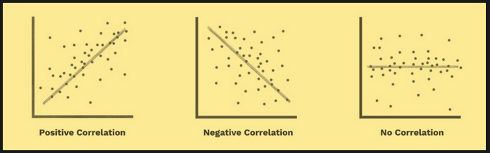
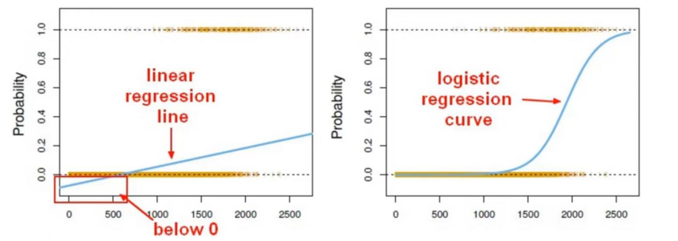

# **Aprendizagem Supervisionada**

## Relação entre Variáveis

### Covariância

A covariância, representada por cov(x, y), descreve a relação linear entre duas variáveis, X e Y. Suas características incluem:

- Quando X e Y têm uma relação positiva: cov(x, y) é positiva.
- Quando X e Y têm uma relação negativa: cov(x, y) é negativa.
- Quando não há uma relação linear constante: cov(x, y) é 0.

O valor da covariância é dependente do tamanho dos desvios padrão dos dados: se grandes, o valor será maior do que se pequenos, mesmo que a relação entre x e y seja a mesma nos conjuntos de dados com grandes ou pequenos desvios padrão.

### Correlação

A correlação mede a relação entre duas variáveis e é indicada pelos coeficientes de correlação. Características incluem:

- Coeficiente de correlação de Pearson (correlação linear): mostra a correlação linear entre duas variáveis contínuas.
- Coeficiente de correlação de postos de Spearman: alternativa não paramétrica ao coeficiente de Pearson.
- Mede a força relativa da relação linear entre duas variáveis.
- Sem unidades.
- Varia de -1 a 1:
  - Quanto mais próximo de -1, mais forte é a relação linear negativa.
  - Quanto mais próximo de 1, mais forte é a relação linear positiva.
  - Quanto mais próximo de 0, mais fraca é qualquer relação linear positiva.
  
A correlação é uma ferramenta valiosa para entender a força e a direção da relação entre variáveis em um contexto de aprendizagem supervisionada.

# Regressão Linear

A Regressão Linear avalia quão bem uma variável independente específica prevê uma variável dependente. Principais características incluem:

- **Objetivo:**
  - Determinar a equação para a linha reta que melhor se ajusta a um conjunto específico de dados.

- **Predição:**
  - Visa prever o valor de uma variável de resultado, Y, com base no valor de uma variável preditora, X.
  - Ajusta uma linha reta em um conjunto de observações e utiliza essa linha para prever valores não observados.

# Regressão Logística

A principal diferença entre Regressão Linear e Regressão Logística é que esta última é usada quando a variável dependente é binária. Principais pontos incluem:

- **Natureza da Variável Dependente:**
  - Regressão Logística é utilizada quando a variável dependente é binária.
  - Regressão Linear é usada quando a variável dependente é contínua e a natureza da linha de regressão é linear.

- **Logistic Regression for Classification:**
  - Utilizada para problemas de classificação.
  - Exemplos incluem spam vs. "ham" em e-mails, inadimplência de empréstimo (sim/não), diagnóstico de doenças, entre outros.
  - Problemas de classificação podem ser binários (duas classes) ou ordinais (mais de duas classes).

- **Transformação Linear para Logística:**
  - Embora o nome possa ser confuso, a regressão logística permite resolver problemas de classificação, onde se busca prever categorias discretas.
  - Na classificação binária, as classes são geralmente designadas como 0 e 1.
  - Não é possível utilizar um modelo linear padrão em grupos binários, pois levaria a um ajuste inadequado.
  - Em vez disso, é possível transformar a regressão linear em uma curva de regressão logística.

- **Função Sigmóide:**
  - A função Sigmóide (ou Logística) recebe qualquer valor e o transforma para o intervalo [0-1].
  - Isso resulta em uma probabilidade de [0-1] de pertencer a uma classe.
  - Um limiar pode ser definido em 0.5 para tomar decisões de classe:
    - Resultados previstos abaixo deste limiar resultam na classe: 0.
    - Resultados previstos acima resultam na classe: 1.

A Regressão Logística é uma ferramenta valiosa para resolver problemas de classificação, especialmente quando se lida com variáveis dependentes binárias.

# Differences between Linear and Logistic Regression

Linear and Logistic regression are fundamental forms of regression commonly used in statistical modeling. Here are the key differences between the two:

- **Dependent Variable Nature:**
  - Linear Regression: Used when the dependent variable is continuous, and the nature of the regression line is linear.
  - Logistic Regression: Used when the dependent variable is binary in nature (two classes).

- **Modeling Approach:**
  - Linear Regression: Models data using a straight line to represent the relationship between the independent and dependent variables.
  - Logistic Regression: Represents the probability of an event as a linear function of a combination of predictor variables. The output is transformed using the sigmoid function to obtain probabilities.

These distinctions highlight the specific use cases and underlying principles that govern the application of linear and logistic regression in statistical analysis.

# Decision Tree

A Decision Tree is a supervised machine learning algorithm used for both classification and regression tasks. It represents a flowchart-like structure where each internal node represents a decision based on the value of a particular feature, each branch represents the outcome of the decision, and each leaf node represents the final decision or the predicted outcome.

## Key Components:

### Nodes:
- **Root Node:**
  - Represents the initial input data and the feature to split on.
  
- **Internal Nodes:**
  - Represent decisions based on the values of specific features.

- **Leaf Nodes:**
  - Represent the final decision or the predicted outcome.

### Edges:
- Connect nodes and represent the outcome of a decision.

### Features:
- Attributes or characteristics used to make decisions at each node.

### Splitting:
- Process of dividing a node into sub-nodes based on a certain feature.

### Pruning:
- Process of removing unnecessary branches or nodes to improve the model's generalization.

## How a Decision Tree Works:

1. **Root Node:**
   - The tree starts at the root node, which includes the entire dataset.

2. **Feature Splitting:**
   - The algorithm selects the best feature to split the dataset based on criteria such as Gini impurity (for classification) or mean squared error (for regression).

3. **Internal Nodes:**
   - Each internal node represents a decision based on the selected feature.

4. **Leaf Nodes:**
   - The process continues, splitting nodes into branches until a stopping condition is met or a predefined depth is reached.

5. **Decision Making:**
   - When new data is input into the tree, it traverses the nodes, and the final leaf node determines the predicted outcome.

## Advantages of Decision Trees:

- **Interpretability:**
  - Easy to understand and interpret visually.

- **Handles Both Numeric and Categorical Data:**
  - Can work with both types of data.

- **No Assumptions about Data Distribution:**
  - Does not make assumptions about the distribution of data.

- **Feature Importance:**
  - Provides information about the importance of different features.

- **Non-Parametric:**
  - Does not make strong assumptions about the underlying data distribution.

## Limitations:

- **Overfitting:**
  - Prone to overfitting, especially with deep trees.

- **Instability:**
  - Small variations in data can result in different tree structures.

- **Biased Toward Dominant Classes:**
  - Biased toward classes with a larger number of instances.

- **Not Suitable for Capturing Complex Relationships:**
  - May struggle to capture complex relationships in the data.

Decision Trees are widely used for their simplicity and interpretability, making them valuable tools in various domains.

# Discrete and Continuous Trees

Decision trees can be categorized into two main types based on the nature of the target variable: discrete (categorical) trees and continuous (regression) trees.

## Discrete Trees (Categorical/Classification Trees):

### Objective:
- **Target Variable:**
  - Categorical or discrete in nature.
  - Examples include classes like 'spam' or 'non-spam,' 'red,' 'green,' or 'blue.'

### How It Works:
- **Decision Nodes:**
  - Each decision node represents a decision based on the values of a specific feature.
  
- **Splitting:**
  - The tree splits nodes based on categorical features.
  
- **Leaf Nodes:**
  - Leaf nodes represent the final predicted categories.

### Example:
- Predicting the species of a flower (e.g., 'setosa,' 'versicolor,' 'virginica') based on features like petal length and width.

## Continuous Trees (Regression Trees):

### Objective:
- **Target Variable:**
  - Continuous or numeric in nature.
  - Examples include predicting values like temperature, stock prices, or sales revenue.

### How It Works:
- **Decision Nodes:**
  - Each decision node represents a decision based on the values of a specific feature.
  
- **Splitting:**
  - The tree splits nodes based on continuous features.
  
- **Leaf Nodes:**
  - Leaf nodes represent the final predicted numeric values.

### Example:
- Predicting the price of a house based on features like square footage, number of bedrooms, and location.

## Advantages:

- **Discrete Trees:**
  - Suitable for classification problems with categorical outcomes.
  - Easy to interpret and visualize.

- **Continuous Trees:**
  - Ideal for regression problems with numeric outcomes.
  - Can capture complex relationships in data.

## Considerations:

- **Discrete Trees:**
  - May not handle ordinal categories well.
  - Sensitive to imbalanced class distributions.

- **Continuous Trees:**
  - Prone to overfitting, especially with deep trees.
  - Can be sensitive to outliers.

Both types of decision trees have their strengths and weaknesses, and the choice between them depends on the nature of the target variable and the characteristics of the data.

# Support Vector Machine (SVM)

## Problem Statement:

Given a set of points on a graph, constructing a function that accurately represents these points and can predict outcomes for new inputs poses a challenge. The difficulty lies in finding a function that is neither too complex (leading to overfitting) nor too simple (resulting in poor generalization).

## Introduction to Support Vector Machine (SVM):

Support Vector Machine (SVM) is a supervised machine learning algorithm primarily used for classification (and occasionally regression) problems. The fundamental concept involves representing each data point as a point in an n-dimensional space, where n is the number of features. SVM performs classification by identifying a hyperplane that effectively separates different classes.

## Key Characteristics:

- **Complexity Control:**
  - SVM addresses the challenge of balancing model complexity. It aims to find a decision boundary (hyperplane) that is optimal for generalization.

- **Handling High-Dimensional Data:**
  - Well-suited for classifying datasets with a high number of features.

- **Hyperplanes:**
  - Decision boundaries in SVM are represented by hyperplanes. These are higher-dimensional planes that differentiate between classes.

- **Kernel Trick:**
  - SVM applies kernels to map data into higher-dimensional spaces. This enables the identification of hyperplanes that may not be evident in lower dimensions.

## How SVM Works:

- **Hyperplanes:**
  - Decision boundaries that classify data points. The dimension of the hyperplane depends on the number of features.

- **Data Classification:**
  - Points falling on either side of the hyperplane are attributed to different classes.

- **Hyperplane Dimension:**
  - The dimension of the hyperplane corresponds to the number of features. For 2 features, the hyperplane is a line; for 3 features, it becomes a two-dimensional plane.

- **Challenges with High Dimensions:**
  - Visualizing hyperplanes becomes challenging when the number of features exceeds 3.

SVM is effective in scenarios where finding a clear decision boundary is crucial, especially in datasets with a high number of features.

