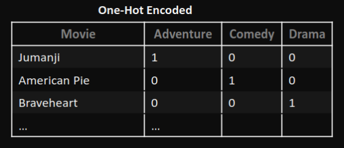
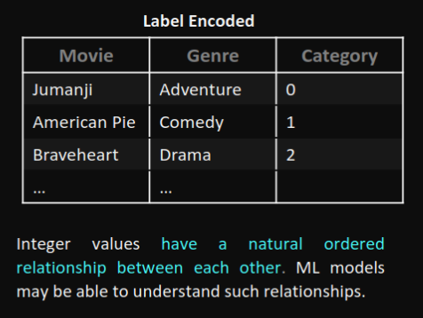

# Dados

- **Dados, Informação e Conhecimento**
- **Dados Estruturados, Não Estruturados e Híbridos**

## Dados, Informação e Conhecimento

### Problemas com Dados

- **Missing Values** 
- **Outliers**
- **Noise** - Modificações aleatórias nos dados (corrupted data) devido a limitações nos instrumentos de medição ou erros humanos.
- **Dados Duplicados**

### Análise de Dados

- **Tendência Central** - Média, Moda, Mediana
- **Dispersão Estatística** - Variância, Desvio Padrão, Intervalo Interquartil
- **Distribuição de Probabilidade** - Gaussiana, Uniforme, Exponencial
- **Correlação/Dependência** - Entre pares de features, com a feature dependente
- **Visualização de Dados** - Tabelas, Gráficos, Boxplots, Scatter Plots, Histogramas

## Tratamento de Dados

### 1. Normalization
- **Normalização de Dados**: Normalizar os dados para que todos os valores estejam dentro de um intervalo específico. Ex.: Normalizar os dados para que todos os valores estejam entre 0 e 1.
> **Rationale**: Muitos classificadores usam métricas de distância (ex.: distância euclidiana) e, se uma feature tem uma ampla gama de valores, a distância será governada por essa feature em particular. Portanto, a amplitude deve ser normalizada para que cada feature contribua proporcionalmente para a distância final.

- **Normalization**: Rescaling data so that all values fall within the range of 0 and 1, for example
$z = \frac{b - a \cdot x - \min(x)}{\max(x) - \min(x) + a}$ 

- **Standardization / Z-Score Normalization**: Rescaling data so that it has a mean of 0 and a standard deviation of 1. Assumes observations fit a Gaussian distribution with a well-behaved
mean and standard deviation, which may not always be the case
 $ z = \frac{xi - \mu}{\sigma} $

 ### 2. Outlier Detection

- **Statistical-based strategy**: Z-Score, Box Plots, 
- **Knowledge-based strategy**: Based on domain
knowledge. For example, exclude everyone with
a monthly salary higher than 1M € …
- **Model-based strategy**: Using models such as
one-class SVMs, isolation forests, clustering

### 3. Feature Selection (Dimensionality Reduction)

Rationale: which features should we use to create a predictive model? Select a sub-set
of the most important features to reduce dimensionality.
The removal of unimportant features:
- May affect significantly the performance of a model
- Reduces overfitting (less opportunity to make decisions based on noise)
- Improves accuracy
- Helps reducing the complexity of a model (reduces training time)

What can we remove:
- Redundant features (duplicate)
- Irrelevant and unneeded features (non-useful)

**In summary**:
- Remove a feature if the percentage of missing values is higher than a threshold;
- Use the chi-square test to measure the degree of dependency between a feature and the target class;
- Remove feature if data are highly skewed;
- Remove feature if low standard deviation;
- Remove features that are highly correlated between each other

**Notes**:

>- **Principal Component Analysis (PCA)**: a technique to reduce the dimension of the feature space. The
goal is to reduce the number of features without losing too much information. A popular application
of PCA is for visualizing higher dimensional data.
>- **Wrapper Methods**: Use a ML algorithm to select the
most important features! Select a set of features as a
search problem, prepare different combinations, evaluate
and compare them! Measure the “usefulness” of features
based on the classifier performance
>- **Embedded Methods**: Algorithms that already have built-in feature selection methods. Lasso,
for example, has their own feature selection methods. For example, if a feature’s weight is zero
than it has no importance! Regularization - constrain/regularize or shrink the coefficient
estimates towards zero

### 4. Missing Values

First analyze each feature in regard to the number and percentage of missing values. Then decide
what to do:

1. **Remove:**
   - **Description:** Remove rows or columns with missing values.
   - **Pros:**
      - Simple and easy to implement.
      - Can be effective when missing values are randomly distributed.
   - **Cons:**
      - Loss of potentially valuable information, especially if missing data is not random.
      - May reduce the size of the dataset.

2. **Mean:**
   - **Description:** Replace missing values with the mean of the available values in that feature.
   - **Pros:**
      - Preserves the mean of the distribution, maintaining the overall central tendency.
      - Simple and quick to implement.
   - **Cons:**
      - May introduce bias, especially if missing values are not missing at random.
      - Can distort the variance and shape of the original distribution.

3. **Interpolation:**
   - **Description:** Estimate missing values based on the values of other data points, using methods like linear interpolation.
   - **Pros:**
      - Utilizes the relationships between variables to estimate missing values.
      - Can provide more accurate estimates than using the mean.
   - **Cons:**
      - Assumes a linear relationship, which may not be appropriate for all data.
      - Complexity may increase with the need for sophisticated interpolation methods.

4. **Mask:**
   - **Description:** Introduce a binary "mask" variable indicating whether the value is missing or not.
   - **Pros:**
      - Preserves the information about the missing values.
      - Allows models to potentially learn patterns related to missingness.
   - **Cons:**
      - Adds complexity to the dataset.
      - Requires additional handling during modeling.
      - May not be suitable for all algorithms.

### 5. Nominal Value discretization

**Rationale**: categorical data often called
nominal data, are variables that contain label
values rather than numeric ones. Several
methods may be applied:
- One-Hot Encoding
- Label Encoding
- Binary Encoding

### 6. Binning

Binning, i.e., group numeric data into intervals - called bins:
Rationale: make the model more robust and prevent overfitting. However, it penalizes the model’s performance since every time you bin something, you sacrifice information.

### 7. Feature Engineering

Feature Engineering:
Rationale: The process of creating new features! The goal is to improve the performance of ML
models.
Example: from the creation date of an observation what can we extract?
2021-10-29 16h30
We may extract new features such as:
• Year, month and day
• Hour and minutes
• Day of week (Thursday)
• Is Weekend? (No)
• Is Holiday? (No)