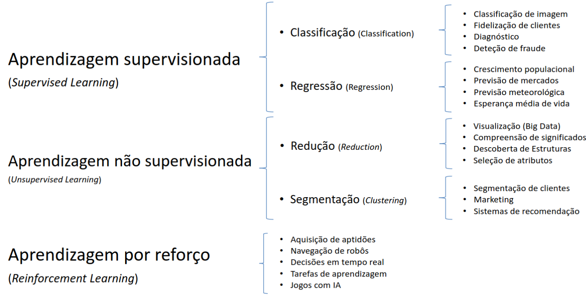
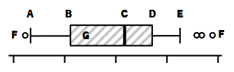
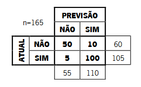

# Teste 2021/2022

## **1. - No desenvolvimento de sistemas de aprendizagem automática (machine learning) podem ser utilizados diferentes paradigmas de aprendizagem. Neste contexto pretende-se que:**
#### **A. - Caraterize os paradigmas de aprendizagem supervisionada, nao supervisionada e por reforço**
#### **B. - Apresente dois exemplos de técnicas de cada paradigma, ilustrando-os com casos de aplicação**


**Aprendizagem Supervisionada:**
- Em aprendizagem supervisionada, o algorítmo é treinado num dataset rotulado, onde os dados de input são emparelhados com os respetivos outputs. O modelo aprende a mapear inputs para outputs, fazendo previsões em novos dados não vistos.
- Paradigma de aprendizagem em que os casos que se usam para aprender incluem informação acerca dos resultados pretendidos, sendo possível estabelecer uma relação entre os valores pretendidos e os valores produzidos pelo sistema.
    - A grande maioria dos algorítmos de ML usa aprendizagem supervisionada.
    - Aprendisazem supervisionada significa que os dados de entrada (x) e os resultados (y), tornam possível que o algorithm aprenda uma função de mapeamento (f) que transforma os dados de entrada nos resultados: y = f(x).
    - Diz-se supervisionada porque este mapeamento é acompanhado por um algorítmo que supervisiona o processo de aprendizagem
    - Duas Categorias Principais:
        - **Classificação:** Quando os resultados são discretos (e.g. preto, branco, cinzento)
        - **Regressão:** Quando os resultados são contínuos (e.g. temperatura, preço, idade)


**Aprendizagem Não Supervisionada:**
- A aprendizagem não supervisionada envolve treinar um modelo em dados não rotulados. O algorítmo identifica padrões, relações ou estruturas nos dados sem rótulos explícitos.
- Paradigma de aprendizagem em que não são conhecidos resultados sobre os casos, apenas os enunciados dos problemas, tornando necessário a escolha de técnicas de aprendizagem que avaliem o funcionamento interno do sistema.
    - A aprendizagem não supervisionada significa que existem dados de entrada (x) mas não existem resultados correspondentes.
    - O objetivo deste tipo de aprendizagem é o de modelar a estrutura ou a distribuição dos dados do problema
    - Categorias Comuns:
        - **Segmentação/Clustering:** Quando se pretende organizar os dados em grupos coerentes (agrupar clientes que compram produtos biológicos)
        - **Redução/Reduction:** Reduzir o número de caraterísticas de um conjunto de dados ou decompor o conjunto de dados em múltiplos conjuntos de dados mais pequenos (e.g. reduzir a dimensionalidade de um conjunto de dados)
        - **Associação:** Quando se pretende conhecer regras que associem o comportamento demonstrado pelos dados (pessoas que compram produtos biolíogicos mas não compram produtos de charcutaria)

**Aprendizagem por Reforço:**

- Aprendizagem por Reforço é centrada num agente que interage com um ambiente. O agente aprende a fazer decisões ao receber feedback sobre a forma de recompensas ou penalizações. O objetivo é maximizar a recompensa cumulativa ao longo do tempo.
- Paradigma de aprendizagem que, apesar de não ter informação sobre os resultados pretendidos, permite efetuar uma avaliação sobre se os resultados produzidos são bons ou maus
    - Algorítmos de Reinforcement Learning usam técnicas de auto-alimentação de sinais, com vista a melhorar os resultados, por influência de recompensas ou penalizações
    - Não se pode comparar com Aprendizagem Supervisionada, uma vez que a "avaliação" dos resultados não é dada por um supervisor
    - Também não se pode considerar Aprendizagem Não Supervisionada, uma vez que não existe ausência absoluta de informação sobre os resultados
    - A aprendizagem dá se pela capacidade de crítica sobre os próprios resultados produzidos pelo algororítmo
        - **Q-Learning:** Assume que está a seguir uma política ótima e usa-a para atualizar os valores das ações
        - **SARSA:** considera a política de controlo que está a ser seguida e atualiza os valores das ações

**Exemplos de técnicas e as suas aplicações:**

### Aprendizagem Supervisionada

1. **Regressão Linear:**
   - **Descrição:** Prevê uma variável de saída contínua com base numa ou mais variáveis de entrada.
   - **Aplicação:** Prever preços de casas com base em características como a área, o número de quartos, etc.

2. **Random Forest:**
    - **Descrição:** Método de aprendizagem em conjunto que constrói múltiplas árvores de decisão e junta as suas previsões.
    - **Aplicação:** Classificar emails como spam ou não spam com base em várias características.

### Aprendizagem Não Supervisionada

1. **K-Means Clustering:**
   - **Descrição:** Divide um conjunto de dados em 'k' clusters com base na sua semelhança.
   - **Aplicação:** Agrupar clientes com base no seu comportamento de compra para marketing direcionado.

2. **Principal Component Analysis (PCA):**
   - **Descrição:** Reduz a dimensionalidade dos dados, preservando o máximo de variância possível.
   - **Aplicação:** Analisar e visualizar dados de alta dimensão, como imagens.


### Aprendizagem por Reforço

1. **Q-Learning:**
   - **Descrição:** Algorítmo de aprendizagem por reforço que aprende valores de ação ótimos para cada estado.
   - **Aplicação:** Treinar um agente para jogar jogos de tabuleiro, como o xadrez ou o Go.

2. **Deep Deterministic Policy Gradients (DDPG):**
   - **Descrição:** Algorítmo ator-crítico para espaços de ação contínuos em aprendizagem por reforço.
   - **Aplicação:** Ensinar um robô a realizar tarefas complexas num ambiente simulado.





## **2. - O processo de desenvolvimento de uma solução de aprendizagem automática envolve diversas etapas, que podem diferir de acordo com a metodologia escolhida. Neste contexto pretende-se que:**
#### **A. - Tendo em conta a metodologia CRISP-DM, pretende-se que enumere e descreva as suas etapas**


1. **Business Understanding:**
   - **Descrição:** Compreender o problema de negócio e definir os objetivos do projeto de machine learning.

2. **Data Understanding:**
   - **Descrição:** Explorar e compreender o dataset, identificando fontes de dados e avaliando a qualidade dos dados.

3. **Data Preparation:**
    - **Descrição:** Limpar, transformar e preparar os dados para o treino do modelo. Isto inclui tratar valores em falta, codificar variáveis categóricas, etc.

4. **Modeling:**
   - **Descrição:** Selecionar e aplicar modelos de machine learning a dados preparados.

5. **Evaluation:**
   - **Descrição:** Avaliar o desempenho dos modelos usando métricas e critérios relevantes.

6. **Deployment:** 
    - **Descrição:** Integrar o modelo desenvolvido no ambiente de produção para uso real.


#### **B. - Tendo em conta a metodologia SEMMA, pretende-se que enumere e descreva as suas etapas**


1. **Sample:**
   - **Descrição:** Selecionar uma amostra representativa do dataset para análise.

2. **Explore:**
   - **Descrição:** Explorar e visualizar os dados para obter informações sobre a sua estrutura e características.

3. **Modify:**
    - **Descrição:** Pré-processar e modificar os dados para melhorar a sua qualidade e prepará-los para a modelação.

4. **Model:**
    - **Descrição:** Construir e aplicar modelos de machine learning aos dados pré-processados.

5. **Assess:**
    - **Descrição:** Avaliar o desempenho dos modelos usando métricas e critérios relevantes.


## **3. Responder Responda às questões deste grupo no espaço reservado PREENCHENDO OS ESPAÇOS VAZIOS com as expressões devidas de modo que a afirmação seja correta**

1. No contexto da utilização de técnicas de machine learning, a adoção de uma metodologia para a extração de conhecimento descreve e cria **`um conjunto de etapas ou fases`** pelos quais deverá passar o desenvolvimento de um projeto de extração de conhecimento para **`obter informações úteis e relevantes a partir dos dados`**.

2. A metodologia de extração de conhecimento que se desenvolve em 5 etapas, denominada de SEMMA, é composta pelas etapas de **`Sample`**, **`Explore`**, **`Modify`**, **`Model`** e **`Assess`**.

3. Support Vector Machine é uma técnica **`supervisionada`** de machine learning que pode ser utilizada para resolver problemas de **`classificação`** e de **`regressão`**.

4. Num diagrama de caixa / boxplot, como no exemplo abaixo, o ponto **C** corresponde à **`mediana`**, a caixa **G** representa **`IQR, ou range interquartil`** dos dados do estudo, e os círculos **F** identificam os valores **`outliers`**. do dataset. O ponto **A** representa o valor **`mínimo (Q1 - 1.5*IQR)`** e o ponto **E** o valor **`máximo (Q3 + 1.5*IQR)`**. O ponto **B** representa o valor **`Q1 (25th percentile)`** e o ponto **D** o valor **`Q3 (75th percentile)`**.




## **4. Considere o dataset Titanic, utilizado várias vezes ao longo do semestre. Considere também o excerto de código apresentado na figura abaixo, onde é apresentada a construção e avaliação de um modelo de aprendizagem automatica. Responda às questões que se seguem.**

```python

df = pd.read_csv('titanic_dataset.csv')

X = df.drop(['Survived', 'Age', 'PassengerId', 'Name', 'Ticket', 'Cabin', 'Embarked', 'Sex'], axis=1)
y = df['Survived']

sex_ohe = pd.merge(df['Sex'], drop_first=True)
embarked_ohe = pd.merge(df['Embarked'], drop_first=True)

X = pd.concat([X, sex_ohe, embarked_ohe], axis=1)
X_train, X_test, y_train, y_test =
train_test_split(y, X, test_size=0.3)

model = Sequential()
model.add(Dense(16, input_dim=y.shape[1],
activation='relu'))
model.add(Dense(8, activation='relu'))
model.add(Dense(1, activation='sigmoid'))
model.compile(loss = 'binary_crossentropy', optimizer = 'adam', metrics = ['mse'])
model.transform(X_train, y_train, epochs=50,
batch_size=32)
loss, acc = model.evaluate(X_train, y_train)

```
### **4.1 - O Excerto de código representado acima apresenta imprecisões, corrija-as.**

```python
# Load the dataset
df = pd.read_csv('titanic_dataset.csv')

# Drop unnecessary columns
X = df.drop(['Survived', 'Age', 'PassengerId', 'Name', 'Ticket', 'Cabin', 'Embarked', 'Sex'], axis=1)
y = df['Survived']

# Perform one-hot encoding for 'Sex' and 'Embarked'
sex_ohe = pd.get_dummies(df['Sex'], drop_first=True)
embarked_ohe = pd.get_dummies(df['Embarked'], drop_first=True)

# Concatenate one-hot encoded columns to the features
X = pd.concat([X, sex_ohe, embarked_ohe], axis=1)

# Split the dataset into training and testing sets
X_train, X_test, y_train, y_test = train_test_split(X, y, test_size=0.3, random_state=42)

# Build the neural network model
model = Sequential()
model.add(Dense(16, input_dim=X.shape[1], activation='relu'))
model.add(Dense(8, activation='relu'))
model.add(Dense(1, activation='sigmoid'))

# Compile the model
model.compile(loss='binary_crossentropy', optimizer='adam', metrics=['accuracy'])

# Train the model
model.fit(X_train, y_train, epochs=50, batch_size=32, verbose=1)

# Evaluate the model on the training set
loss, acc = model.evaluate(X_train, y_train)
print(f"Training Loss: {loss}, Training Accuracy: {acc}")
```

1. O `pd.merge()` não é usado para fazer one-hot encoding, mas sim o `pd.get_dummies()`

2. Quando a função train_test_split é usada os argumentos deveriam ser X e y e não y e X

3. O parametro `input_dim` do modelo Sequential na primeira camada deveria ser o número de features (colunas) e não o número de linhas do dataset 

4. o metodo `model.transform` não é válido, o método correto é `model.fit`

5. As labels `Survived` são binárias (0 ou 1), mas o modelo está a usar uma função de ativação `sigmoid` na última camada, o que é adequado para classificação binária. No entanto, está a tratar-se como um problema de regressão ao usar `mse` (mean squared error) como métrica. Deveria usar `accuracy` como métrica


### **4.2 Identifique a técnica de aprendizagem utilizada neste excerto de código e indique quatro hiperparâmetros passiveis de serem modificados para afinar o modelo** 

O excerto de código apresenta uma rede neural utilizando a biblioteca Keras (parte do TensorFlow). A técnica de aprendizagem é Deep Learning, especificamente uma Rede Neural Artificial. A rede neural é construída usando o modelo sequencial (Sequential), com camadas densas (Dense) e a função de ativação ReLU nas camadas ocultas e uma função de ativação sigmoid na camada de saída.

Quatro hiperparâmetros que podem ser modificados para afinar o modelo são:
- **units:** Este é o número de neurónios em cada camada. Aumentar ou diminuir o número de unidades pode afetar a capacidade do modelo
- **learning_rate:** A taxa de aprendizagem controla o tamanho dos passos que o otimizador dá durante a atualização dos pesos. Ajustar a taxa de aprendizagem pode afetar a rapidez com que o modelo converge para uma solução
- **epochs:** O número de épocas determina quantas vezes o modelo verá todo o conjunto de dados durante o treino. Aumentar o número de épocas pode melhorar o desempenho do modelo, mas também pode levar a overfitting e vice versa pode levar a underfitting
- **batch_size:** O tamanho do lote define quantos exemplos de treino sã o usados numa iteração. Modificar este valor pode afetar a velocidade de treino e estabilidade do modelo

```python
# Example on How to use Hyperparameter Tuning
model = Sequential()
model.add(Dense(32, input_dim=X.shape[1], activation='relu'))  # Modify units
model.add(Dense(16, activation='relu'))  # Modify units
model.add(Dense(1, activation='sigmoid'))

# Compile the model with a different learning rate
model.compile(loss='binary_crossentropy', optimizer=Adam(learning_rate=0.001), metrics=['accuracy'])

# Train the model with a different number of epochs and batch size
model.fit(X_train, y_train, epochs=100, batch_size=64, verbose=1)
```


### **4.3 - Admita que o dataset Titanic não está balanceado. Descreva de que forma este desbalanceamento influencia o modelo**

Quando um dataset não está balanceado, a distribuição de classes (neste caso, se um passageiro sobreviveu ou não) será significativamente skewed (enviesada) para uma classe. No contexto do dataset do titanic, se a maior parte dos passageiros não sobreviveu o dataset será considerado desbalanceado. O impacto de um dataset desbalanceado num modelo de Machine Learning poderá ser substancial:
- **Bias do Modelo:** Datasets desbalanceados podem levar a modelos enviesados, uma vez que o algorítmo poderá favorecer a classe maioritária. O modelo poderá ter um mau desempenho a prever instâncias da classe minoritária
- **Accuracy Misleading:** A accuracy poderá não ser uma métrica apropriada para avaliar o performance do modelo num dataset desbalanceado. Um modelo a prever a classe maioritária para todas as instâncias poderá ter uma accuracy muito elevada mas falha em detetar padrões importantes na classe minoritária
- **Limited Generalization:** Datasets desbalanceados podem levar a modelos que generalizam mal para novos dados, em especial para a classe minoritária. O modelo poderá não capturar os padrões subjacentes necessários para fazer previsões precisas em cenários reais

Para lidar com datasets desbalanceados, várias técnicas podem ser aplicadas tais como resampling (oversampling da classe minoritária ou undersampling da classe maioritária), usar diferentes métricas de avaliação (precisão, recall, f1-score, etc) ou usar algorítmos que lidam melhor com datasets desbalanceados.


## **5. Comente as afirmações seguintes, assinalando a sua veracidade (V) ou falsidade (F), justificando sempre a sua resposta.**
### **1 - No desenvolvimento de sistemas de aprendizagem automática, a fase de preparação de dados tem particular importância porque os dados obtidos do «mundo físico» são incompletos, contêm lixo e são falsos.**

True

Num desenvolviment o de um sistema de machine learning, preparação dos dados é crucial visto que dados obtidos do mundo real são muitas vezes incompletos, contêm ruído e podem conter informação falsa (CNN,MSNBC,SIC noticias etc.). Para construir um modelo robusto e preciso é essencial tratar destes problemas durante a fase de preparação de dados.


### **2 - Técnicas de aprendizagem automática baseadas no desenvolvimento de árvores de decisão são utilizadas exclusivamente para a resolução de problemas de classificação.**

False

Técnicas de machine learning baseadas em árvores de decisão, como Random Forests, podem ser aplicadas a ambos os problemas de classificação e regressão. Enquanto que as árvores de decisão são geralmente usadas para problemas de classificação, também podem ser adaptadas para problemas de regressão, tornando-as versáteis e úteis em vários cenários.


### **3 - Paradigmas de aprendizagem com supervisão exigem maior intervenção humana do que qualquer outro paradigma uma vez que necessitam de quem desempenhe o papel de supervisor.**

False

Paradigmas de aprendizagem supervisionados envolvem dados rotulados por humanos, contudo não necessitam necessáriamente de mais intervenção humanda do que outros paradigmas. Por exemplo, algoritmos de aprendizagem nao supervisionada envolvem mais decisões humanas a definir a tarefa e interpretar os resultados. O nível de intervenção humana depende do problema e do paradigma de aprendizagem usado.	


### **4 - O tratamento de valores nulos (missing values) existentes num dataset pode envolver a remoção de observações/registos ou de atributos/características.**

True

Lidar com missing values num dataset pode envolver remover records ou atributos. Dependendo na quantidade e natureza dos valores em falta, outras técnicas podem ser usadas como imputação (substituir os valores em falta por estimativas). A escolha de estratégia depende no impacto dos valores em falta na análise e nas características do dataset.


### **5 - A matriz de confusão em baixo apresenta um valor de accuracy de 165/150.**



False

Accuracy = True Positives + True Negatives / Total

True positives = 100
True Negatives = 50
Total = 165

Accuracy = 150/165 = 0.909 = 90.9%


### **6 - Num processo de aprendizagem automática, a qualidade dos dados não afeta os resultados do processo uma vez que na fase de preparação de dados serão resolvidos todos os problemas como, por exemplo, ruído, outliers, dados falsos ou dados duplicados.**


False

A qualidade dos dados afeta significativamente os resultados de um processo de machine learning. Problemas como ruído, outliers, false data e valores duplicadoes podem introduzir biases e erros no modelo. Enquanto que alguns problemas podem ser resolvidos durante a fase de preparação de dados, a qualidade global dos dados é um fator crítico em determinar o sucesso de um modelo.


# **Teste 2022/2023**


## **1. Complete os espaços em branco com a expressão devidamente preenchida de modo a que a afirmação seja correta.**

- Numa metodologia de análise de dados como o **`CRISP-DM`**, a preparação de dados é uma tarefa anterior à **`modelação`** e é preponderante visto que os dados recolhidos do mundo real podem apresentar-se **`incompletos, com ruído e inconsistências`**

- Algorítmos de clustering tais como **`K-Means`** e **`Hierarchical Clustering`** implementam uma técnica de aprendizagem **`não supervisionada`** com o objetivo de agrupar um conjunto de casos de estudo, de tal forma que os objetos no mesmo grupo apresentam mais **`semelhanças`** entre si do que com os objetos de outros grupos.

- Feature Engineering permite a criação de **`variáveis/features`** a partir da informação disponível, como forma de auxiliar o **`modelo`** a realizar previsões mais **`precisas`**


## **2. - Em alguns algoritmos de Machine Learning é usada a técnica de descida por gradiente (gradient descent) no processo de otimização dos parâmetros do algoritmo**

### **2.1 - Quais poderão ser os motivos para esta convergir lentamente ou não convergir**

Convergência lenta ou não convergência pode ser causada por vários fatores:
- **Learning Rate:** Se a learning rate for demasiado pequena, o algorítmo poderá converger muito lentamente, requirindo mais iterações para alcançar os parâmetros ótimos
- **Complexidade do Modelo:** Modelos muito complexos poderão converger lentamente em particular se o landscape para otimização tiver muitas regiões planas

Não Convergência:
- **Learning Rate:** Se a learning rate for demasiado grande, o algorítmo poderá divergir e não convergir para os parâmetros ótimos ou poderá oscilar em torno dos parâmetros ótimos.
- **Inicialização dos Parâmetros:** Se os valores iniciais forem mal escolhidos o algorítmo poderá não convergir para os parâmetros ótimos
- **Landscape de Otimização:** Se o landscape de otimização tiver muitos mínimos locais ou saddle points, o algorítmo poderá convergir para um mínimo local em vez do mínimo global


### **2.2 - Indique 2 exemplos de algoritmos de Machine Learning que façam uso desta técnica**

Linear Regression:
- Em regressão linear, a descida por gradiente é frequentemente usada para otimizar os coeficientes (parametros) que minimizam o MSE (mean squared error) entre os valores reais e os valores previstos

Logistic Regression:
- Em regressão logística, usada para classificação binária, a descida por gradiente é usada para minimizar a função de custo ou perda. O objetivo é encontrar os pesos otimos que minimizam a cross-entropy loss function.


## **3. - Verdadeiro ou Falso? Justifique sempre a sua resposta.**

### **3.1 - O algoritmo de aprendizagem Decision Tree apresenta normalmente um melhor dsempenho quando comparado com o algoritmo de aprendizagem Random Forest, apresentando carateristicas que possibilitem mitigar o problema de overfit de dados**

False

Decision Trees e Random Forests servem propósitos diferentes. Decision trees tendem a overfit visto que poderão criar árvores muito complexas que se ajustam demasiado aos dados de treino. Random Forests por outro lado são conjuntos de árvores que conseguem mitigar overfitting ao agregar previsões de várias árvores. De facto, Random Forests frequentemente apresentam melhor desempenho que Decision Trees.


### **3.2 - A Off-Policy Learning verificada nos algoritmos de Reinforcement Learning considera a avaliação e a optimização da respetiva policy aplicada para a seleção das ações do algoritmo inteligente**

True

Off-Policy learning em Reinforcement Learning refere-se ao cenário onde a policy do agente para selecionar àções é diferente da policy usada para gerar os dados. Isto pode envolver a avaliação e otimização de uma polcy diferente da que é usada para selecionar ações, permitindo aprendizagem mais flexível


### **3.3 - Uma matriz confusão é uma métrica de avaliação de desempenho de modelos de Reinforcement Learning**

False

Uma Confusion Matrix é uma métrica mais comummente usada em supervised learning, particularmente para tarefas de classificação para avaliar o performance de um modelo ao comparar as labels previstas com as labels reais. Em reinforcement Learning, a avaliação do performance de um agente utiliza, normalmente, outras métricas como cumulative rewards e success rates.


### **3.4 - Em todos os algoritmos de clustering é necessário justificar a quantidade de clusters a procurar nos dados**

True

Em clustering, a escolha do numero de clusters (k) é um aspeto crucial que impacta a qualidade dos resultados. Diferentes valores de K podem levar a clusters muito diferentes. Várias técnicas como o método do cotovelo (elbow method) e o método da silhueta (silhouette method) podem ser usadas para determinar o valor de K que melhor se adequa aos dados.